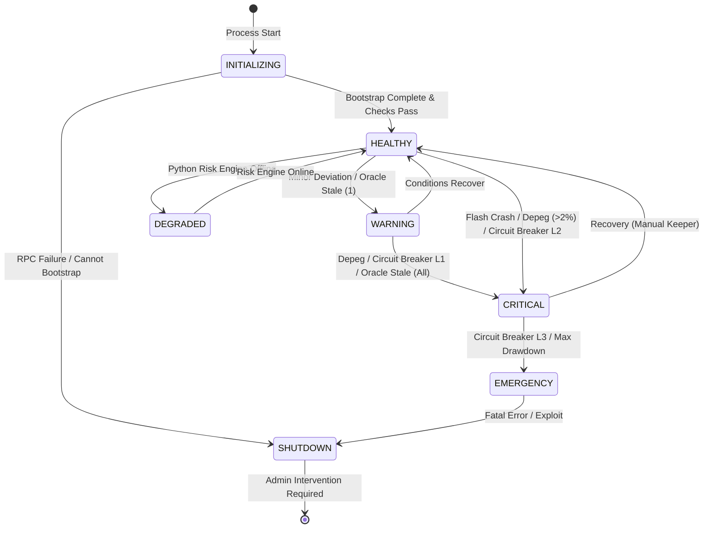

# Autonomous Treasury Management System: Architecture

## System Overview

The Autonomous Treasury Management System is a multi-layered, autonomous platform designed for managing a DAO treasury on the Hyperliquid ecosystem. The system is split across three isolated execution layers to balance on-chain security with off-chain computational requirements.

```mermaid
graph TD
    subgraph "Layer 1: On-Chain (HyperEVM)"
        TV[TreasuryVault.sol]
        SH[SecurityHooks.sol]
        OA[OracleAdapter.sol]
        AR[AssetRegistry.sol]
        SM[StrategyManager.sol]
        GM[GovernanceModule.sol]
        
        Strat1[StableYieldStrategy]
        Strat2[LiquidityProvisionStrategy]
        Strat3[PerpHedgingStrategy]
        Strat4[BasisTradeStrategy]

        TV --> SH
        TV --> OA
        TV --> AR
        TV --> SM
        TV --> GM
        
        SM --> Strat1
        SM --> Strat2
        SM --> Strat3
        SM --> Strat4
    end

    subgraph "Layer 2: Execution (Guardian Service - Node.js/TS)"
        Orch[Orchestrator]
        SM_TS[State Machine]
        ExRouter[Execution Router & TWAP]
        Mon[Stablecoin & Health Monitor]
        BC[Blockchain Interface & Multicall]
        
        Orch <--> SM_TS
        Orch --> ExRouter
        Orch <-- Mon
        Orch <--> BC
    end

    subgraph "Layer 3: Risk Engine (Python FastAPI)"
        API[FastAPI Server]
        Opt[Portfolio Optimizer]
        VaR[VaR Models]
        Cov[Covariance Builder]
        MC[Monte Carlo Simulation]
        HMM[Regime Detector HMM]
        
        API --> Opt
        API --> VaR
        API --> Cov
        API --> MC
        API --> HMM
    end

    %% Interactions
    BC <-->|RPC Calls / Multicall| TV
    ExRouter -->|Sign Txs| TV
    Orch <-->|HTTP REST / Circuit Breaker| API
    
    %% External
    ExtO[Chainlink / Pyth] --> OA
    ExtDEX[Hyperliquid L1 / DEX] <-- Strat3
    ExtDEX <-- Strat4
```

## Component Responsibilities

### Layer 1: Smart Contracts (HyperEVM)
- **`TreasuryVault.sol`**: The core repository of funds. Executes swaps, batch actions, tracks portfolio snapshots, and implements circuit breakers.
- **`SecurityHooks.sol`**: Evaluates all actions before execution (allocation bounds, slippage limits, HHI concentration, etc.). Must pass for trades/actions to succeed.
- **`OracleAdapter.sol`**: Manages pricing by aggregating data from external oracles (Pyth, Chainlink) and on-chain TWAP. Includes flash-loan defense.
- **`StrategyManager.sol` & Strategy Contracts**: Interfaces for deploying capital into yield-bearing or hedging vehicles (Stable Yield, Basis Trade, Perp Hedging, LP).
- **`AssetRegistry.sol`**: Manages whitelisted tokens, allocations, and haircuts.
- **`GovernanceModule.sol`**: Implements a timelock and proposal system for upgrading system parameters and whitelisting.

### Layer 2: Guardian Service (TypeScript)
- **State Machine**: Transitions the system between HEALTHY, WARNING, CRITICAL, DEGRADED, and SHUTDOWN states.
- **Orchestrator**: Ties all systems together. Bootstraps state from HyperEVM via multicall, queries the Risk Engine, and schedules execution.
- **Execution Router (TWAP)**: Breaks large rebalance/trade operations into smaller, time-weighted slices to minimize market impact and slippage.
- **Monitors**: Monitors stablecoin pegs and system health constantly. Triggers alerts and circuit breakers off-chain.
- **Blockchain Interface**: Manages nonces, speeds up pending transactions, parses revert reasons, and handles EIP-1559 gas pricing safely.

### Layer 3: Risk Engine (Python)
- **Portfolio Optimizer**: Computes target weights using Risk Parity and Black-Litterman models.
- **Risk Metrics**: Calculates Historical, Parametric, and Monte Carlo Value at Risk (VaR) and Expected Shortfall (CVaR).
- **Covariance Builder**: Shrinks empirical covariance using Ledoit-Wolf and Random Matrix Theory for robust optimization.
- **Regime Detector**: Uses Gaussian Hidden Markov Models (HMM) to classify the market state (bull, uncertain, crisis).

## Data Flow

### Rebalancing Flow
1. **Bootstrap/Read**: Guardian uses `Multicall3` to read portfolio balances, prices from `OracleAdapter`, and strategy TVL from `TreasuryVault`.
2. **Predict Regime**: Guardian sends price history to Python `Regime Detector`.
3. **Analyze Risk**: Guardian sends portfolio and covariance data to Python `VaR Models`.
4. **Optimize Allocation**: Guardian sends regime and VaR to `Portfolio Optimizer` to determine target weights.
5. **Execute**: Guardian calculates differences between current and target weights. Uses `TWAP Engine` to slice trades. Sends transactions to `TreasuryVault`.
6. **Validate On-chain**: `SecurityHooks` checks if trades violate bounds.
7. **Settle**: `TreasuryVault` updates `assetLedgers` and `snapshotHistory`.

### Hedging Flow (Derivative)
1. **Risk Alert**: Guardian detects a significant delta or VaR breach.
2. **Hedge Calc**: Python engine calculates required short Perp position size to become delta neutral.
3. **Instruct Hedge**: Guardian triggers `openHedge()` on the `PerpHedgingStrategy` or `BasisTradeStrategy` via `TreasuryVault`.
4. **Hyperliquid Execution**: Strategy pushes order to Hyperliquid L1 (via system contract or API). Margin is locked.

## State Machine (Guardian)


